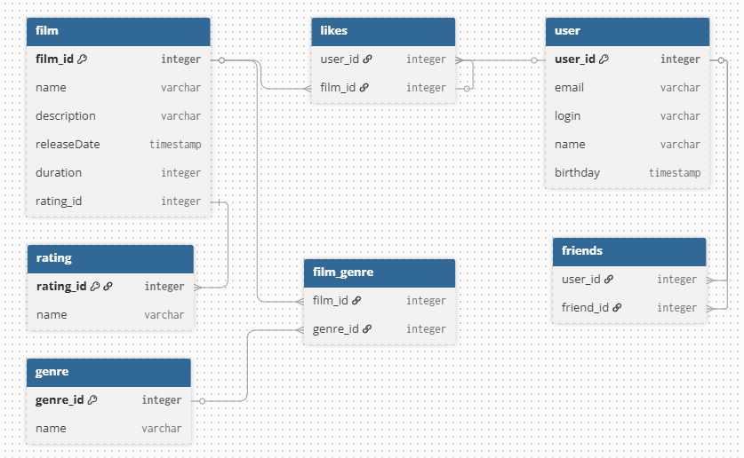

# java-filmorate

Приложение Filmorate - площадка для общения и взаимодействия пользователей.

Добавлена возможность заводить друзей, оставлять отзывы и рекомендовать фильмы друг другу.

Чтобы пользователи ориентировались в том, что происходит на платформе, реализована лента событий.

Добавлен поиск — в приложении легко находить фильмы по ключевому слову из названия или описания, а также по режиссёру.

### Схема БД



### Примеры запросов

```sql
SELECT *
FROM film
```

```sql
SELECT *
FROM users
WHERE user_id = 2
```

```sql
SELECT film_id
FROM likes
GROUP BY film_id
ORDER BY COUNT(user_id) DESC
LIMIT 10
```